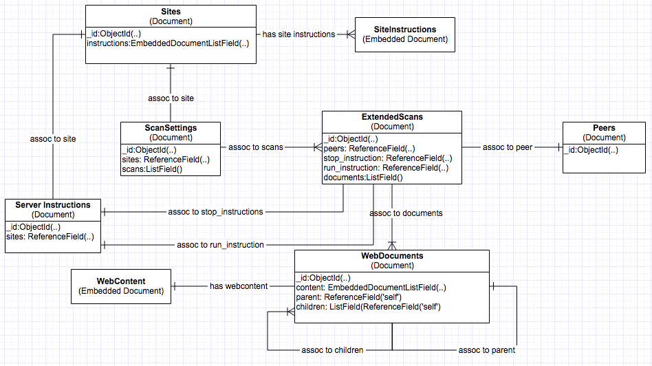

===========================================================
``Distpickymodel`` shared Mongoengine-based model library
===========================================================

.. image:: https://travis-ci.com/d2gex/distpickymodel.svg?branch=master
    :target: https://travis-ci.com/d2gex/distpickymodel

.. image:: https://img.shields.io/badge/version-0.1.0-orange.svg
    :target: #

A library that is shared and used by different services of the distributed web scraper. The 'data relationship'
diagram is shown below:

